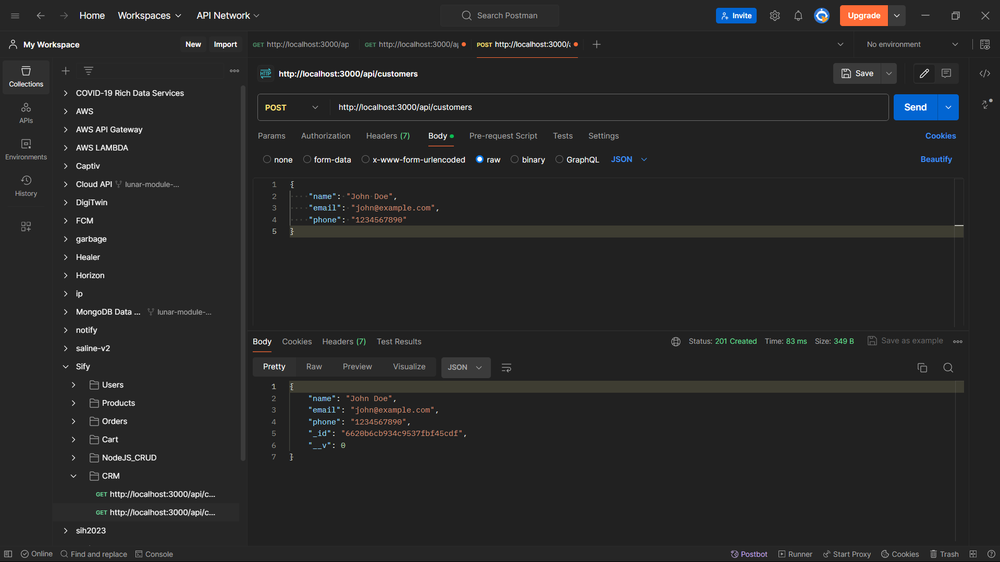

# CRM API Documentation

This is a RESTful API for a CRM (Customer Relationship Management) system built using Node.js, Express, and MongoDB.

## Setup and Initialization

1. Clone the repository:

   ```bash
   git clone https://github.com/sinehan001/crm-api.git
   ```

2. Installation Dependencies

   ```bash
    cd crm-api
    npm install
   ```

3. Set up MongoDB:
   Make sure you have MongoDB installed and running locally or provide the MongoDB URI in app.js.

4. Start the server:
   ```bash
   npm start
   ```

## API Endpoints

#### Create Customer

- **URL**: POST /api/customers
- **Request Body**:

```http
{
    "name": "John Doe",
    "email": "john@example.com",
    "phone": "1234567890"
}
```

- **Response**:

```http
{
  "_id": "60a9f3b4a4a2c835241882a1",
  "name": "John Doe",
  "email": "john@example.com",
  "phone": "1234567890",
  "__v": 0
}
```

#### Read All Customers

- **URL**: GET /api/customers
- **Response**:

```http
[
  {
    "_id": "60a9f3b4a4a2c835241882a1",
    "name": "John Doe",
    "email": "john@example.com",
    "phone": "1234567890",
    "__v": 0
  },
  {
    "_id": "60a9f3d5a4a2c835241882a2",
    "name": "Jane Smith",
    "email": "jane@example.com",
    "phone": "9876543210",
    "__v": 0
  }
]
```

#### Read One Customer

- **URL**: GET /api/customers/{id}
- **Response**:

```http
{
  "_id": "60a9f3b4a4a2c835241882a1",
  "name": "John Doe",
  "email": "john@example.com",
  "phone": "1234567890",
  "__v": 0
}
```

#### Update Customer

- **URL**: PUT /api/customers/{id}
- **Request Body**:

```http
{
    "name": "John Doe",
    "email": "john@example.com",
    "phone": "5555555555"
}
```

- **Response**:

```http
{
  "_id": "60a9f3b4a4a2c835241882a1",
  "name": "John Doe",
  "email": "john@example.com",
  "phone": "5555555555",
  "__v": 0
}
```

#### Delete Customer

- **URL**: DELETE /api/customers/{id}
- **Response**:

```http
{
  "message": "Customer deleted successfully"
}
```

## Screenshots




## Authors

- [@sinehan001](https://www.github.com/sinehan001)


## License

[MIT](https://choosealicense.com/licenses/mit/)

